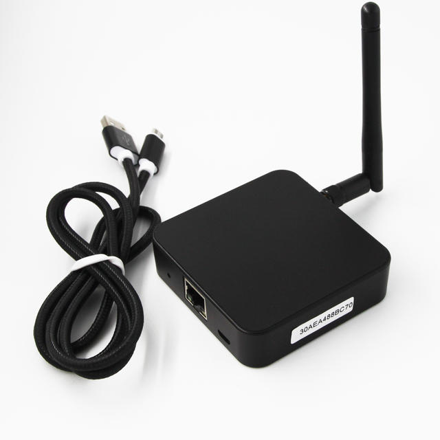

# BLE GW MQTT JSON Parser
### Parse BLE GW JSON messages from MQTT broker and return them decoded back to the broker.

As does [@OH2MP](https://github.com/oh2mp/), I also am using Mosquitto as a broker and InfluxDB + Telegraf with Grafana. See [CONFIG_EXAMPLES.md](https://github.com/oh2mp/esp32_ble2mqtt/blob/main/CONFIG_EXAMPLES.md) from his project.

This script sends the decoded data as JSON to the broker and the dataformat is compatible with @OH2MP's [BLE2MQTT](https://github.com/oh2mp/esp32_ble2mqtt) project. See [DATAFORMATS.md](https://github.com/oh2mp/esp32_ble2mqtt/blob/main/DATAFORMATS.md)

## Supported BLE beacons include:
- [Ruuvi tag](https://ruuvi.com/) (Data format V5 aka RAWv2 only)

More to be supported eventually. Goal is to support the same as OH2MP ESP32 BLE2MQTT

## Hardware prerequisites

- [April Brother BLE Gateway 4.0](https://blog.aprbrother.com/product/ab-ble-gateway-4-0)
- See also [April Brother Wiki](https://wiki.aprbrother.com/en/AB_BLE_Gateway_V4.html) for documentation
- and their Github for [ab-ble-gateway-sdk](https://github.com/AprilBrother/ab-ble-gateway-sdk)

## Software prerequisites
- Some MQTT broker like Mosquitto running somewhere.
- Perl libraries Net::MQTT::Simple and JSON::Tiny

## Configure the BLE GW
- Get the latest firmware so that it supports JSON as plain text without msgpacking it.
- Setup it's network and other parameters
- Select MQTT topic and configure it for your MQTT broker

I used blegw/json as the topic for messages from the BLE GW. That is then subscribed for this script for processing

## Configuring the script
Two files are needed for the script config.txt and known_tags.txt. Both files are TAB separated lists.

### config.txt
```
mqtthost	mqtt.server.com:1883
username	mqttuser
password	SecretPasswordForMQTT
sub_topic	blegw/json/#
pub_topic	blegw/decoded
```

Note! the password is not encrypted and is sent in the clear as SSL is not implemented for now.

### known_tags.txt
```
ee:b4:25:31:cd:52	vaasanrinne7/ulko
ec:ee:96:87:ce:fc	vaasanrinne7/sisä
f8:30:99:04:9c:cd	vaasanrinne7/sauna
ec:b1:3e:0b:17:4f	vaasanrinne7/pakastin
d7:a0:8f:0f:55:2d	vaasanrinne7/jääkaappi
fa:99:df:0f:c6:70	vaasanrinne7/terassi
c1:ea:33:8d:78:3f	goa753/ulko
c5:35:43:fd:63:2a	goa753/sisä
f5:ae:63:b0:4d:3a	goa753/jääkaappi
```
Only the known tags are reported back to the broker with the matching name added to the pub_topic from config.txt.

# Sample data on the broker
## The raw JSON message from the gateway
```
blegw/json {"v":1,"mid":441899,"time":456266,"ip":"192.168.100.33","mac":"246F28756A40","devices":[[3,"606DC77D0894",-48,"1DFF2D0102000110A93DCB7816C04B33AB4E58C4D4C4D140CEB7239E5C76"],[0,"C9F83F118A94",-49,"02010609FF5900C9F83F118A94"],[0,"E063DA835E30",-68,"0201061106E568F2C45FE5DEA0104CD81AC81A4E05040855434B"],[0,"C869CD0B794D",-44,"02011A020A0C0AFF4C0010050D1452FA31"],[3,"162634C8B92C",-44,"02011A0BFF4C0009060305C0A864A5"],[0,"4A222EB3942F",-70,"0201060AFF4C0010054F1C8C1070"],[0,"0009B0352BBE",-43,"03039FFE17169FFE0000000000000000000000000000000000000000"],[0,"C7C1238D0D42",-50,"02010609FF5900C7C1238D0D42"],[0,"7D6F9D04C0EB",-71,"02011A020A0C0BFF4C001006131E090A0B68"],[3,"2A50FBD75BE0",-71,"02011A03036FFD17166FFDE05A18C5C5A481FF7CDC7C1279910BE2DC579F32"],[0,"EAF5CE67B66A",-81,"02010603020FFE08160FFE0610B07B0E"],[0,"79BDB3D036C2",-42,"02011A020A0C0AFF4C0010051A1C4B12E6"],[3,"288A2BE73149",-91,"1EFF0600010920023FC865BBDAE3400FD3C11C43D97329F8AB105A0A7566AD"],[0,"5D575FB53D9F",-65,"02011A020A0C0BFF4C001006031E293C6940"],[0,"D2A6448F5CE2",-66,"100954543231344820426C756546726F6703190000020106050323152316"],[0,"CA471649C5B6",-63,"02010609FF5900CA471649C5B6"],[3,"7ABAC4EFD6C5",-88,"1EFF0600010920021727B9C8B5B1A57331A78190AB3E92515888A4CB83E891"],[0,"F62A2423A5D7",-91,"02010603020FFE08160FFE0610B07B0E"],[0,"C2B0D8ECF67B",-81,"02010603020FFE08160FFE0610B07B0E"],[0,"52A863DB8B32",-95,"02011A020A0C0BFF4C0010061F1A67F237CC"],[3,"F83099049CCD",-88,"0201061BFF9904050E6E336DC7A603D0FE840014A33697D9ADF83099049CCD"],[3,"FA99DF0FC670",-87,"0201061BFF99040510862E51C7A2001CFFF40414ADB69474E8FA99DF0FC670"],[3,"ECEE9687CEFC",-75,"0201061BFF9904050FFE311CC798FFF000040420AB7689241EECEE9687CEFC"]]}
```

## The decoded JSON messages sent back to the broker

```
blegw/decoded/vaasanrinne7/sauna {"type":1,"t":184,"rh":32,"bu":2905,"ap":1011,"s":-88}
blegw/decoded/vaasanrinne7/terassi {"type":1,"t":211,"rh":29,"bu":2989,"ap":1011,"s":-87}
blegw/decoded/vaasanrinne7/sisä {"type":1,"t":204,"rh":31,"bu":2971,"ap":1010,"s":-75}
```

# Disclaimer
The device was built to my own needs, and has only been tested in the northern hemisphere east of Greenwich, so negative coordinates may or may not work properly. This has also not been checked for memory leaks. Feel free to create an issue and I'll try to fix the code at some time, or not. Even better if you have a fix, let me know and I can import the fix.

# Thanks
- [@OH2MP](https://github.com/oh2mp/) for the ESP32 based BLE2MQTT project and dataformats
- @AprilBrother for creating the BLE Gateway
